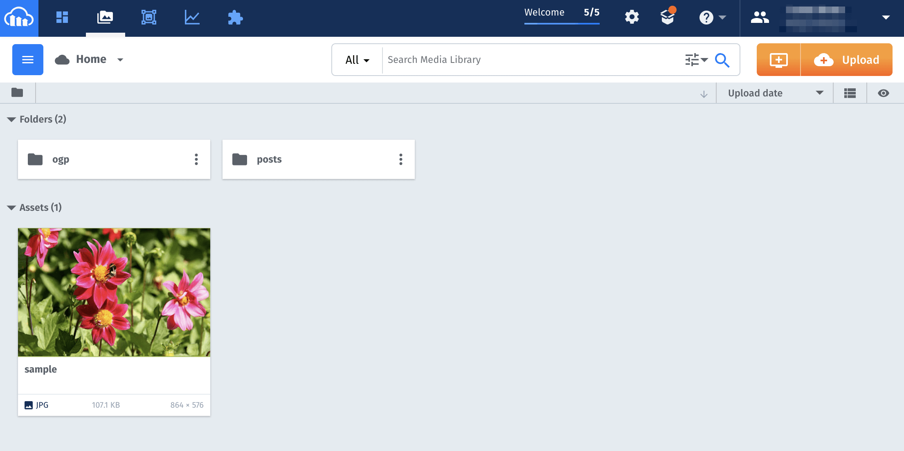
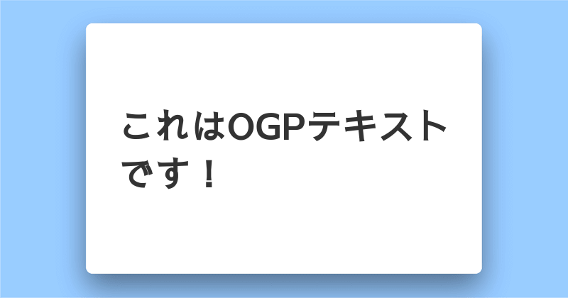

質問箱やDev.toをはじめとして動的に生成されるOGP画像を見かけることが増えた。

[[imageMedium]]
| 

やっていることはシンプルで背景となるフレーム画像の上にテキストをのせているだけだ。

## どのようにOGP画像を作るか
まずはいくつか代表的な方法を紹介する。

### 選択肢1：ImageMagickを使う
Railsアプリケーションの場合、**ImageMagic**が選択肢に挙がるだろう。サーバーで画像を生成することになるため悪意のあるユーザーにより意図しないOGP画像を生成されるのは防ぎやすい。
[[simple]]
| ただし、ユーザーによる投稿をフックにしてOGP画像を生成しようとすると、サーバーへの負荷が大きくなってしまう可能性がある。また、ユーザー体験を損ねないように非同期で画像生成処理を行うなどの工夫が必要かもしれない。

### 選択肢2：html2canvasでクライアント側で処理を行う
[html2canvas](https://html2canvas.hertzen.com/)という超便利なJavaScriptライブラリを使えば、指定したHTMLのキャプチャを撮ることができる。つまりHTMLとCSSでOGP画像のベースを作っておき、html2canvasに「この部分をキャプチャしてね」と指定するわけだ。あとはいつものように画像をサーバーにPOSTする。

### 選択肢3：Cloudinaryを使う
[Cloudinary](http://cloudinary.com)は画像のクラウド管理サービスだ。アップロードした画像をキャッシュしてCDN配信してくれるだけでなく、リサイズやトリミングなどの画像変換もURLで指定するだけで実現できる。
Cloudinaryを使えば**画像に文字を埋め込むのも超簡単**だ。上述の2つの方法とは比べ物にならないほどに簡単。
というわけで、この記事ではその方法を紹介する。
[[simple]]
| Cloudinaryは無料枠が大きいので小規模なサービスやメディアなら無料枠で十分足りる<br>
| 👉 [**Cloudinaryの料金**](https://cloudinary.com/pricing)


## Cloudinaryで動的にOGP画像を生成する方法

[[simple]]
| Cloudinaryに登録していない方は[登録](https://cloudinary.com/pricing)しておく。クレジットカードを登録しなくても無料枠を使える（2019年4月時点）。


たったの2ステップでOGP画像を動的に生成できる。
1. **背景画像をCloudinaryにアップロードする**
2. **OGP画像用のURLを打ち込む**

### 1. 背景画像をアップロード
画像はAPI経由だけでなく、Cloudinaryの管理画面（[Media Library](https://cloudinary.com/console/media_library)）からもアップロードできる。

アップロードは、フォルダーからブラウザに画像をドラッグ＆ドロップするだけ。


👆今回は例としてシンプルな背景画像（800x420）を使う。この画像は[こちら](https://www.dropbox.com/s/7xhksqctnrsl46v/ogp.png?dl=0)からダウンロードできる（自由に使ってもらってOK）。

#### 画像サイズに注意
Cloudinaryで画像にテキストを埋め込む際、サイズはpxでの指定になる（％指定はできない）。今回はアップロードした画像の幅が800pxという前提で話を進める。

### 2. OGP画像用のURLを打ち込む
アップロードできたら画像のURLを取得しよう（サムネイル横のリンクマークをクリックするだけ）。次のようなURLのはずだ。

```html:title=デフォルトのURL
https://res.cloudinary.com/hoge/image/upload/v12345678/filename.png
```

👆CloudinaryではこのURLの中に「こうリサイズして！」や「この文字を埋め込んで！」などの指示を含めることができる。

```html:title=指示を追加
https://res.cloudinary.com/hoge/image/upload/ここ！/v12345678/filename.png
```

👆具体的には`upload/ここ!/`に書く。

今回のケースでは[Text overlay](https://support.cloudinary.com/hc/en-us/articles/202521442-How-to-add-a-text-overlay-)という変換処理を行う。

#### 設定の書き方
画像にテキスト埋め込むためには
```html:title=
l_text:フォント種類_フォントサイズ_ウェイト:配置するテキスト,オプション
```
という書き方をする。
[[simple]]
| ##### フォント種類
| [GoogleFont](https://fonts.google.com/)から選ぶ。公式のサポートページでは「GoogleFontのフォントはすべて使える」と書かれていたが、比較的最近追加されたNotoSansJPなどの日本語フォントは使えなかった。なぜか「Sawarabi Gothic」だけは使えたので今回はコレで試すことにする。ちなみにフォント名の半角スペースは`%20`で置き換える
| ##### フォントサイズ
| 絶対値（px）で指定する。単位は含めない。
| ##### ウェイト
| 太字にしたい場合は`bold`を指定する。記載しなかった場合は`normal`になる。
| ##### 配置するテキスト
| ここにOGP画像に載せるテキストを書く。
| ##### オプション
| 半角カンマ区切りで書く。テキストカラーなどはここに。

今回は以下のオプションを指定する。

[[simple]]
| ##### co_rgb
| `co_rgb:333`のように色コードでテキストカラーを指定
| ##### w_幅
| `w_500`のようにテキストの表示領域の幅（px）を指定。デフォルトでは画像の中央にこの領域は配置される
| ##### c_fit
| これを指定すると文字が右端まで達すると改行される。指定しなかった場合は、テキストが幅に合わせて自動で縮小される


まとめると次のようになる。これを画像のURLの中に追加する。
```html:title=こんな指定にする
l_text:Sawarabi%20Gothic_45:テキスト,co_rgb:FFF,w_500,c_fit
```

## 完全なURL
最終的なURLは次のようになる。
```html
https://res.cloudinary.com/hoge/image/upload/l_text:Sawarabi%20Gothic_50_bold:これはOGPテキストです！,co_rgb:333,w_500,c_fit/v12345678/filename.png
```
このURLをブラウザに打ち込めば、生成された画像が表示される。


あとはメタタグに動的に生成されたURLを含めるようにすれば良い。
```html:title=メタタグを指定
<!--OGP画像を指定-->
<meta property="og:image" content="https://res.cloudinary.com/hoge/image/upload/l_text:Sawarabi%20Gothic_50_bold:これはOGPテキストです！,co_rgb:333,w_500,c_fit/v12345678/filename.png"/>

<!--Twitterカードはラージサイズに-->
<meta name="twitter:card" content="summary_large_image">

<!--その他のOGPタグは省略-->
```

簡単に動的OGP画像を実現できた。
