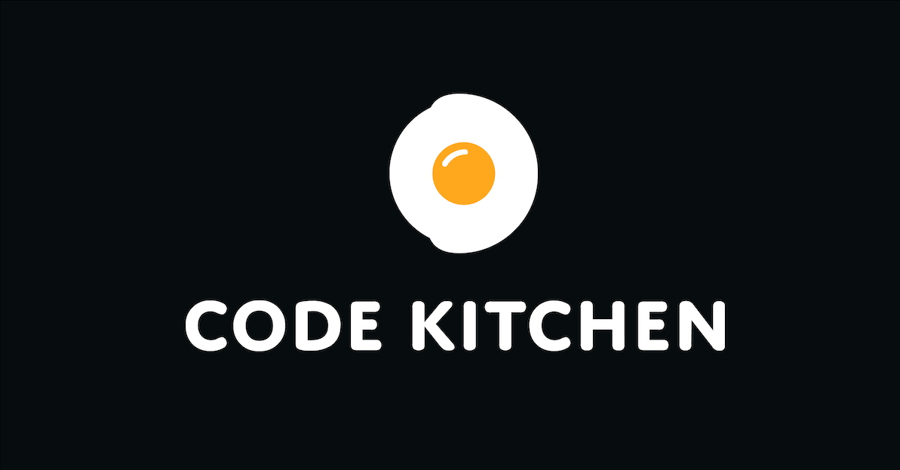
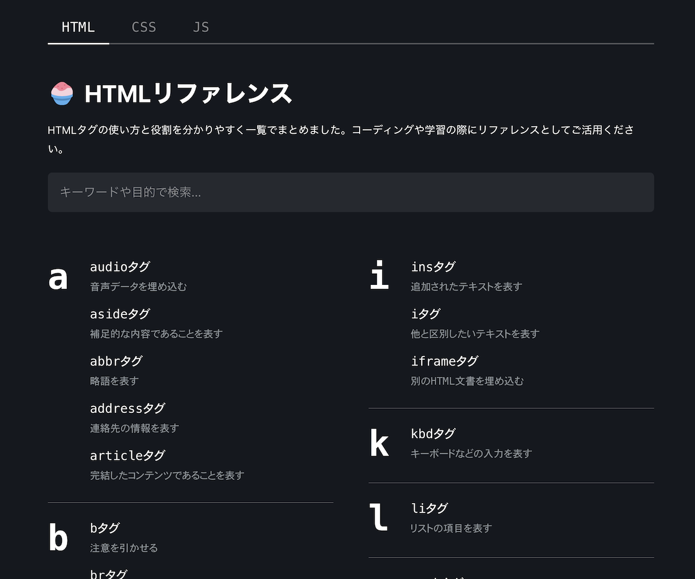

[Code Kitchen](https://code-kitchen.dev/)というものを始めた。

## コンセプト

コンセプトは、**Web制作の「あれどうやって作るの？」を料理レシピのように探せるナレッジベース**。たとえば、かっこいいリンクカードの作り方は１つの「レシピ」。そのレシピを作るのに必要なHTMLやCSS、JavaScriptの知識は「食材」。「レシピと食材の両方を探せる場所を作ろう」という思いつきから、このメディアを始めた。

## 構想
いつか僕がウェブ開発についての教材を作ることになったとき、他の教材が真似できない付加価値をつけたい。有料が販売するなら、価格以上の価値があるものしたい。

### 課題の整理

分かりやすい学習教材は**学ぶ側が現在持っている知識を使って、新しい概念を伝えること**に長けている。言い換えると、学ぶ側が現在持っている可能性が高い知識を見極めている。

学習内容をある程度高度にするとき、どうしても必要な知識は増える。Aを実現するためには、B、C、D、E...という前提知識が必要になる。

---

ある教材は「Aの解説」のために必要な知識B、C、D、E...の解説を放棄する。当然知っているよね？というように「Aをするためには、B、C、D、Eを使いましょう」とだけ言って次に進んでしまい、学習者は途方に暮れる。誰もが経験のあることだと思う。

---

ある教材は「Aの解説」のために必要な知識B、C、D、E...のすべてを丁寧に解説する。全くの初学者からすると最高だ。しかしある程度知識がある人からすると、冗長で退屈なものになってしまう。

---

ある教材は「Aの解説」をすることを諦める。高度な内容は教材に含めない。まったくの初心者でも理解できるような、初心者向けのトピックだけをカバーする教材を作る。学習者からするとサクサク進んで気持ちが良いが、教材を終えた後にどうすれば良いか分からなくなる。

### どうするか

均一な教材を提供する以上、この問題を解決するのは不可能だ。
不可能だと理解したうえで、僕がベストプラクティスだと思っているのは、**学習者が知っている可能性のある周辺知識は解説せずに、その知識への素早くアクセスできる方法を用意すること**だ。

Aの実現のために必要なのはB、C、D、E...だと示しておき、Bだけを知らない人はBだけサクッと学べるようにしておく。公式ドキュメントへのリンクを貼るのははダメだ。今学んでいる教材と同じテンポで学べるものじゃないといけない。

[[simple]]
| できれば今読んでいるページから離脱しない手段が良い。例えば、ツールチップやモーダルのような表現が有効かもしれない。

これを実現するためには、教材を作る側がコントロールできる膨大なリファレンスが必要だ。

### Code Kitchenで取り組むこと

Code Kitchenでまず取り組むのはリファレンス作りだ。

どんなフレームワークを使うことになってもWeb開発では必要になるHTML、CSS、JavaScript（Vanilla JS）の基礎知識をカバーしたい。できる限り[WHATWG](https://html.spec.whatwg.org/multipage/)などの一次情報をベースに執筆を進めていく。
これは大変な作業だが、僕にとっても学びが多く楽しい。

その次のステップとして、リファレンスをベースにちょっとした開発のレシピを作っていく。「このレシピを作るには、この食材（周辺知識）が必要です」と提示できることが目標だ。

## ゆっくりと規模を広げていく
現在これとは別に開発中のサービスもあり（もうすぐリリースする）、2020年はそちらに全力を注ぐつもりでいる。
Code Kitchenは現段階では僕の趣味の挑戦で、息抜きのようなものだ。
自分のペースでのんびりと進めていく。

[[simple]]
| **[👉🏼 Code Kitchen](https://code-kitchen.dev)**