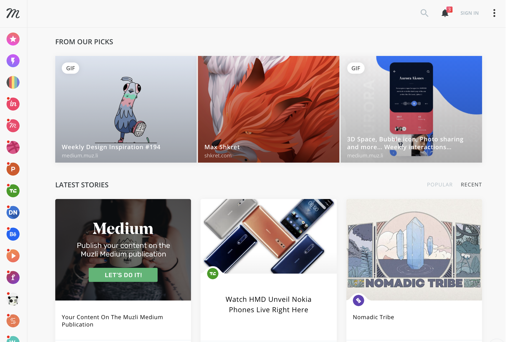
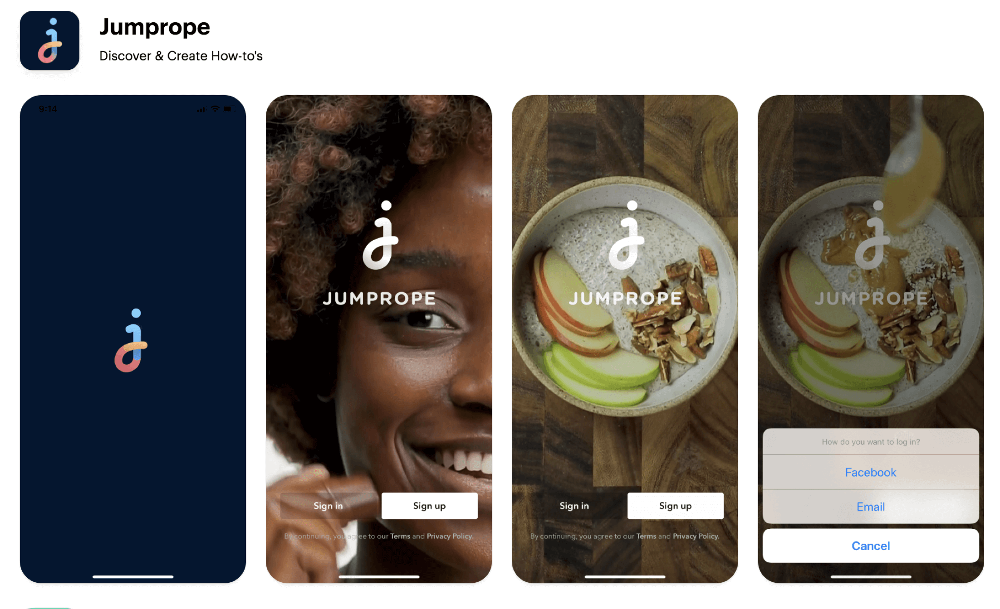
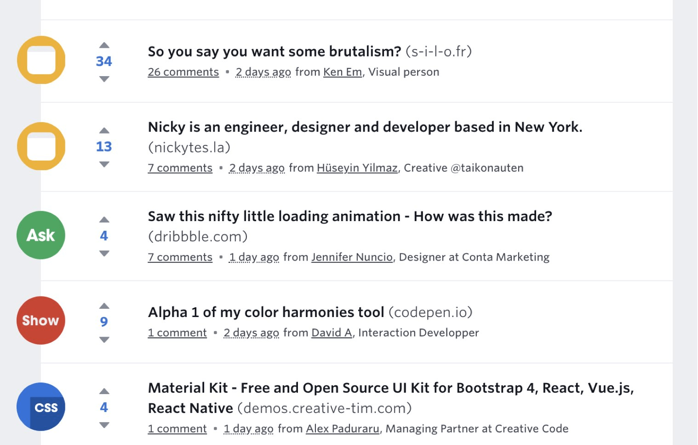
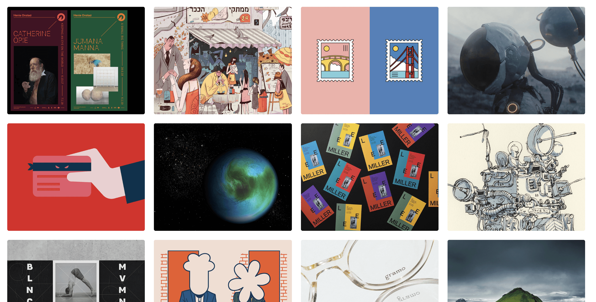
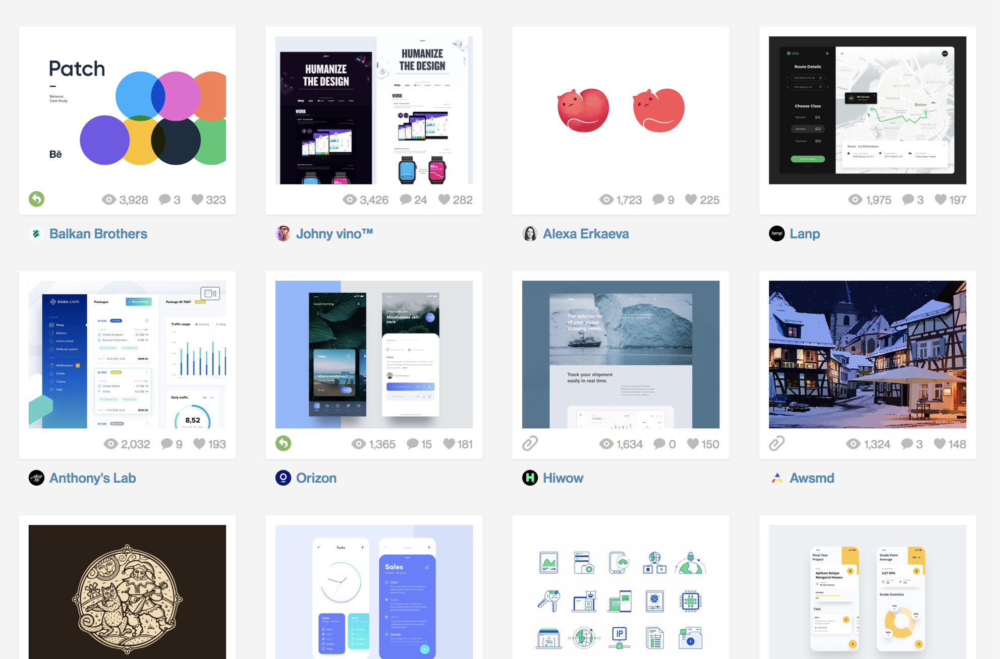
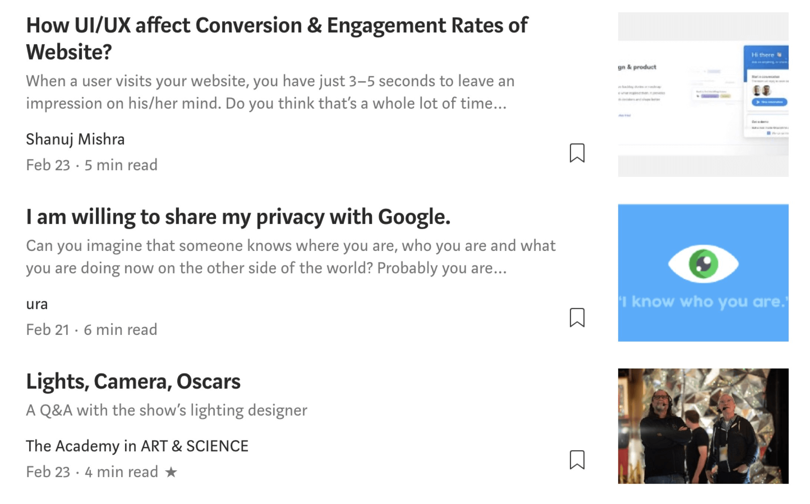

僕が日々チェックしているデザイン系のニュースサイトやWebサービスなどを紹介。

## Muzli

Chromeの拡張機能として入れておくと空のタブにデザインやアート系の**トレンド記事**や人気の**DribbbleやBehanceの作品**が表示される。世界のトップクリエイターたちの作品が見ると創作意欲が刺激される。仕事中につい見すぎてしまうのが難点。
[[simple]]
| **[👉🏼 Muzli](https://muz.li/)**

## Mobbin

クールなUIのモバイルアプリのスクリーンショットがひたすら掲載されている。何が良いって厳選されているところ。
[[simple]]
| **[👉🏼 Mobbin](https://mobbin.design/)**

## Designer News

デザイナー向けのユーザー投稿型のニュースサイト。
プログラマーなら読んでいる人も多いであろう[Hacker News](https://news.ycombinator.com/)のデザイナー版というイメージ。毎朝、上から順番に1つずつポチポチしていくと新しい発見があって楽しい。

## Behance

Adobeのクリエイター向け作品投稿プラットフォーム。あらゆるジャンルの昨日が投稿されているが、特にグラフィックやイラスト系のハイレベルな作品をエンドレスに拝むことができ、目の保養になる。

[[simple]]
| **[👉🏼 Behance](https://www.behance.net/featured)**

## Dribbble

こちらも有名な作品投稿プラットフォーム。こちらもあらゆるジャンルの作品があげられているがUIデザインをひたすらインプットするのに最高。
Behanceは作品詳細ページに画像が一挙に表示されるが、Dribbbleでは拡大表示されるのは1枚ずつ。そのぶん比較的読み込みが早いので、いろんな人の作品を転々と見て回るのに適している。
[[simple]]
| **[👉🏼 Dribbble](https://dribbble.com)**

## Medium Design

海外では定番中の定番となっているブログメディア「Medium」のDesignトピックページ。画像中心の記事を除けば、英語を読む必要があるが、内容が面白い記事を読めることが多い。最近プレミアム会員限定の記事が増えてきてる印象。
[[simple]]
| **[👉🏼 Medium design](https://medium.com/topic/design)**

デザインの情報収集はこのラインナップを習慣的にチェックし、ときどき本を読むというのが個人的にとてもフィットしている。