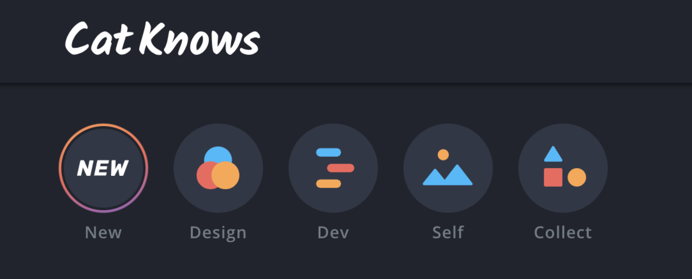

何かを書きたくなったときに、気軽に書けるようにこのブログをつくった。

## 書きたいときに書きたいことを
考えたことや感動したこと、主張したいことを、書きたくなったときに書く場所がほしかった。
誰の役に立つか分からないような情報まで、ダラダラとこのブログに書き残す。
記事のテーマもごちゃまぜ。とにかく書きたいときに書きたいことを書くつもり。

## 技術記事をストレスなく書きたかった
マークダウンで技術的な話をさくっと書き残すとき、ローカルのエディター（VSCode）上で書きたかった。
その方がいくつものタブを開かなくても良くて気軽だし、サービスのUIに慣れられるし、自分の書きやすいように気軽にカスタマイズできる。
この辺りについては[ブログ執筆を効率化するための工夫](/blazing-fast-writing)に少し詳しく書いた。

## Gatsby.jsを使いたかった
Gatsby.jsを以前に触ったとき、Reactで自分の好きなようにカスタマイズできるのが嬉しかった。
試してみたいデザインや表現もあった。
そんなわけで、このブログを開設した。

## デザイン的なこだわり
[[imageSmall]]
| 
カテゴリーはInstagramのように円形で表現してみた。ダークな背景に赤・青・橙の図形なんかを組み合わせて、ポップな雰囲気が感じられるデザインにしてみた。選択中のカテゴリーのアイコンにはグラデーションの枠がつくのだけど、よく見るとアニメーションがかかっている。深い意味はなくて、やってみたかっただけ。

[[imageSmall]]
| 
アイキャッチ画像には絵文字を使っている。記事ごとに絵文字を選ぶだけ。アイキャッチ画像を記事ごとに作る必要なし。

