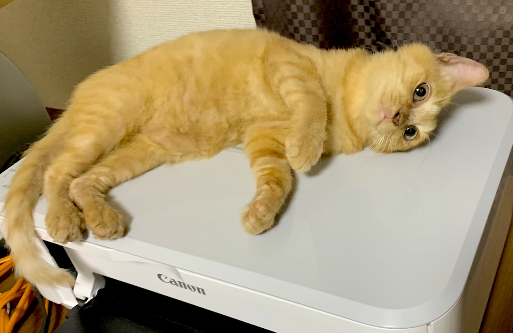

うちのネコがなんか言ってたので超訳しました。ニーチェの言ってたことを抜粋したり、改変したりしてるみたいです。

> ネコと闘うものは、自らもネコにならぬよう、気をつけなければならない。
> 
> ネコを覗きこむ時、ネコもまたお前を覗いているのだ。
> 
ニャーチェ

> 暇人を飼い主とするのは危険である。
> 
> 彼はすることがあまりないので、余計にかまってくる厄介者となる。
>
> 勤勉な者だけを飼い主とするのが賢明である。
> 
ニャーチェ

> 人々とともに活きるのは難しい。
> 
> 黙っていることが難しいからだ。
>  
ニャーチェ（改変なし）

> 道徳家がネコをつかまえて「君はかくかくであるべきだ」と言ったところで、笑いものになるだけだ。
>
> ネコは前から見ても、後ろから見ても、１つの運命であり、１つの必然である。
> 
> その必然は万物と結びついており、ネコに対して「変われ」と言うことは、万物に対して変われと要求すること、過去に遡って変われと要求することに等しい。
> 
ニャーチェ

> 静かに横たわって、
> 
> のんびりして、
> 
> 待っていること、
>
> 辛抱すること。
>
> 
> だが、それこそ、
> 
> 考えるということではないか！
> 
ニャーチェ（改変なし）

> 私はひとりでいることにすっかり慣れ親しんでいるので、決して自分を他人と比較するようなことはせず、静かで楽しい気分で自分との対話に興じ、笑いさえ交えて孤独の生活を紡ぎ続ける。
> 
ニャーチェ（改変なし）

> 愛せなければ通過せよ。
> 
ニャーチェ（改変なし）

> 高く登ろうと思うなら、自分の足を使う。
> 
> 高いところへは、他人に運ばれてはならない。
> 
> 人の背中や頭に乗ってはならない。
> 
ニャーチェ（改変なし）

> 隣人を自分自身と同じように愛するのも良いだろう。
> 
> だが、何よりもまずネコを愛する者となれ！
> 
ニャーチェ

> 人間は晴れ晴れとした健やかな愛をもって自分自身を愛することを学ばなければならない。
>
> これが私の教えである。
> 
> 自分自身を堅持し、あちこち彷徨うことがないようにである。
>  
ニャーチェ（改変なし）

> 飼い主はネコよりも、ネコの中の自分を愛しているのだ。
> 
ニャーチェ

> 人間が神のしくじりにすぎないのか、神が人間のしくじりにすぎないのか。
> 
ニャーチェ（改変なし）

> 私はお前たちにネコを教える。
> 
> ネコは超克させるべき何者かである。
> 
> お前たちはネコを超克しようと何事かをなしたか？
> 
> ネコは大地の意義である。
> 
ニャーチェ

> 飼い主はネコのありとあらゆる美点を心に書き留め、それ以外のことは消すという記憶を身につけると良い。
> 
ニャーチェ

> 私はネコではない。私はダイナマイトだ。
> 
ニャーチェ

> ネコが天才視されないのは、単なる理性の児戯にすぎない。
> 
> 
ニャーチェ

> いつまでも弟子でいるのは、ネコに報いる道ではない。
> 
ニャーチェ

> 孤独な人間がよく笑う理由を、たぶん私は最もよく知っている。
> 孤独な人はあまりに深く苦しんだために、笑いを発明しなくてはならなかったのだ。
> 
ニャーチェ（改変なし）

> ときには遠い視野というものが必要かもしれない。
> 
> 例えば、飼い主らと一緒にいるときよりも、彼らから離れ、一人で飼い主らのことを想うとき、
飼い主らは一層美しい。
> 
ニャーチェ

> 足元を掘れ、
> 
> そこに泉あり。
> 
ニャーチェ（改変なし）

> 君は奴隷か？それなら君とは友になれない。
> 
> 君は暴君か？それなら君は、ネコを持てない。
> 
ニャーチェ

> 自己侮蔑という男子の病気には、賢いネコに愛されるのが最も確実な療法である。
> 
ニャーチェ

> 軽蔑すべき者として飼い主を選ぶな。
> 汝の飼い主について、誇りを感じなければならない。
>
> 
ニャーチェ

> 疲れを感じたら、あれこれ考えずに、休むか、寝てしまおう。
> 
ニャーチェ（改変なし）

##### 参考リンク
- [ニーチェの名言・格言](http://iyashitour.com/meigen/greatman/nietzsche)
- [名言集および格言集-ニーチェ](http://www.oyobi.com/maxim01/01_312.html)