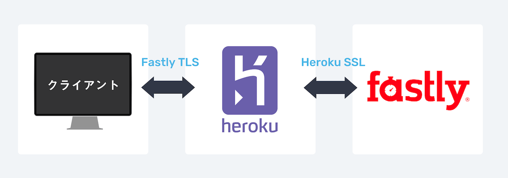

僕がつくったポートフォリオ作成サービスRESUMEでは、ページをまるごとFastlyにキャッシュさせています。CSSや画像などをキャッシュさせるのは簡単ですが、ページ自体をキャッシュさせるとなると途端に難易度が上がります。ページキャッシュに関して、あまりインターネット上には知見がなかったため、ここにまとめておこうと思います。

## RESUMEの技術スタック

前提としてRESUMEでは主に以下の技術・サービスを使っています。

- Ruby on rails
- Vue.js
- Heroku
- Fastly
- S3
- CloudFront

Fastlyにはページデータとサービスのアセット（CSSやサービス内で使われている画像など）をキャッシュさせ、S3/CloudFrontにはユーザーがアップロードした画像を保存しキャッシュしているという形です。

## なぜFastlyを使ったか

もともとはHerokuにデプロイしてページデータをキャッシュさせるつもりはありませんでした。しかし、いざHerokuにデプロイしてみると、どうしてもレスポンスの遅さが気になってしまいました（Herokuでは現在エンタープライズプランでしか国内リージョンを提供していません）。

そこで、爆速だと話題になった[Dev.to](https://dev.to/)を参考にFastlyを使ってキャッシュすることにしました。

## Dev.toの構成

Dev.toもRails + Heroku + Fastlyで構成されています。ほとんどのページをキャッシュし、CDN配信することが爆速に大きく寄与しています。Fastlyにキャッシュすることで、アセットやページデータのHTTP/2配信も可能になります。

## Rails + Fastlyでページキャッシュを実現する手順

さて、ここからが本題です。Rails + Fastly + Herokuでページキャッシュを実現するための方法を説明していきます。

### 1. HerokuでFastlyのアドオンを追加
まず、HerokuでFastlyのアドオンを追加します。

[[simple]]
| 👉 [**Fastly:Heroku Add-ons**](https://elements.heroku.com/addons/fastly)

アセットだけでなくページデータまでキャッシュするためには、Herokuとブラウザのやり取りの間に常にFastlyに入ってもらうことになります。
「ブラウザからFastlyにリクエストを投げ、FastlyがHerokuからデータを受け取る」という要領です。
キャッシュするページに限らず、すべてのリクエストをFastlyを通して行います。

ポイントはクライアントとFastlyのやり取りにHerokuのSSLは使えないということです。ページをキャッシュするためにはFastlyで用意されたTLSを使う必要があります。ここで独自ドメインを使うためにはFastlyのTLSプランに入らなければなりません。


#### 独自ドメインを使うためにはTLSプランが必須
独自ドメインを使ってページごとキャッシュするにはHeroku FastlyアドオンのTLSプランに入らなければなりません。つまり**55ドル/月**（2019年3月時点）がFastlyアドオン代としてかかってきます。これは避けようがありません。
[[simple]]
| 👉 [**Fastlyアドオンのプランと料金**](https://elements.heroku.com/addons/fastly#pricing)


### 2. Fastlyの管理画面で独自ドメインを追加
アドオンを追加したらFastlyの管理画面を開きます。
[[simple]]
|✏ Herokuアプリ管理画面の「Resources」タブの「Fastly」をクリックするとFastlyの管理画面が開きます

#### Domains設定
CONFIGUREタブから「Domains」⇒「CREATE DOMAIN」を選びます。

「Domains」に使用したい独自ドメインを追加します。コメントには自分が分かりやすいような文言を書いておきます。

#### Origins設定
次に「Origins」⇒「CREATE A HOST」を選びます。

👆このように設定します。これ以外の部分は基本的にデフォルトのままでOKです。


これでFastly管理画面での設定は一旦完了。「**Activate**」をクリックするとその設定が反映されるようになります。

### 3. 独自ドメインのTLS設定
次に独自ドメインのTLS設定を行います。この操作はFastlyのHeroku CLIプラグインから行います。
[[simple]]
| 👉 [**heroku-fastly:GitHub**](https://github.com/fastly/heroku-fastly)
このリポジトリのREADMEに書かれている通りにやれば設定は完了します。

#### FastlyのHeroku CLIプラグインをインストール
```
heroku plugins:install @fastly/heroku-plugin
```

#### カスタムドメインを登録
```
heroku fastly:tls www.example.com --app my-heroku-app
```
「登録が完了するまでに数分かかるので、その間にTXTレコードを作成してね」というメッセージが表示されます。
`globalsign-domain-verification=xxxxxxxx`という行がTXTレコードの値になります。

#### TXTレコードを作成
僕の場合は、Herokuの[PointDNSアドオン](https://devcenter.heroku.com/articles/pointdns)に以下のように登録しました。
[[imageMedium]]
|

#### 認証を行う
TXTレコードを作成したら次のコマンドで認証を行います。
```
heroku fastly:verify start www.example.com --app my-heroku-app
```
すると「wwwドメイン」か「apexドメイン（wwwなしのドメイン）」か聞かれます。
[[simple]]
|Fastlyはwwwドメインを推奨しており、apexドメインにするには別の手続きが必要になります。詳しくは[Using Fastly with apex domains](https://docs.fastly.com/guides/basic-configuration/using-fastly-with-apex-domains)をチェックしてみてください。

認証が完了するまでしばらく時間がかかります（僕の場合30分くらいかかった記憶があります）。

#### CNAMEを追加
以下のコマンドで認証のステータスをチェックできます。
```
heroku fastly:verify status www.example.com --app my-heroku-app
```
完了している場合にはCNAMEの値が返ってくるので、こちらもPointDNSに追加します。

#### Done
ドメインの設定は以上で完了です。

--------

### 4. キャッシュするページにset-cookieを含めないようにする
#### Fastlyでキャッシュされる条件
Fastlyでは以下の条件にマッチしたページのみキャッシュされます（[参考](https://support.fastly.com/hc/en-us/community/posts/360040167351-Fastly%E3%82%B5%E3%83%BC%E3%83%90%E3%83%BC%E3%81%AETTL%E3%81%AE%E9%81%B8%E6%8A%9E%E3%83%AD%E3%82%B8%E3%83%83%E3%82%AF)）。
[[simple | キャッシュされる条件]]
| 1. HTTPリクエストメソッドがGET（PUT/POST/DELETEなどのリクエストはキャッシュされない）
| 2. レスポンスにSet-Cookieが含まれていない場合
| 3. レスポンスにCache-Control: privateが含まれていない場合（`Cache-Control: no-store, no-cache`だとキャッシュされる）

Railsのデフォルトの挙動ではHTTPレスポンスに`Set-Cookie`が含まれます。つまり`Set-Cookie`を外してやればGETリクエストのレスポンスがキャッシュされるようになるというイメージです。

3の`Cache-Control`については、Railsではデフォルトでキャッシュされる値になっています。絶対にキャッシュされてはいけないページには`Cache-Control: private`を返すようにしておくと良いでしょう。

#### いかにしてSet-Cookieを外すか
繰り返しになりますが、`Set-Cookie`を外してやればGETリクエストのレスポンスがキャッシュされるようになります。
Fastly公式のGemを使うとが楽にできるようになります。
[[simple]]
|👉 [**fastly-rails:GitHub**](https://github.com/fastly/fastly-rails)

例えば、本一覧ページ（books#index）をキャッシュさせたい場合、以下のように指定します。
```ruby{2}:title=books_controller.rb
class BooksController < ApplicationController
  before_action :set_cache_control_headers, only: [:index]

  def index
    ...
  end

end
```
これで`books#index`のレスポンスにSet-Cookieが含まれないようになります（ブラウザのDevツールからResponse Headersをチェックしてみてください）。
ただこのGemが2017年からメンテされていないようなので使用するには注意が必要です。可能なら自分でメソッドを作った方が良いかもしれません。

#### キャッシュさせないために


### 3. HTTP2配信設定を行う


## キャッシュしたいページを指定する

### set-cookieを除去するメソッドを定義しておく

このメソッドが呼び出されるアクションはキャッシュされなくなります。

ブラウザで確認することができます。HIT

## パージ（キャッシュデータの削除）をどうするか

### パージ用のメソッドを定義しておく

### モデルに削除を紐付ける

    

## ユーザーごとに表示を変えるページをどうキャッシュするか

ログインユーザーのデータをどうするか。一度コンテンツを表示します。

localStorageに必要なデータだけを入れておく。これにより体感のラグを抑えることができます。

### ページ自体をキャッシュするうえで気をつけなければならないこと

- 

## Fastly + RailsでCSRF Tokenをどう取得するか

2つの方法が紹介されています。1つは、ESIを使った方法、もう1つは

---

【Railsでページキャッシュ】キャッシュできないコンテンツをどう扱うか

以下のような点がキャッシュできません。

- CSRF Token
- ログインユーザーのデータ

戦略1 ESIを活用する

しかし、この場合、キャッシュの旨味が半減してしまいます。

戦略2 Tokenを後から取得する

Dev.toもこの方法を取っています。つまり、ページデータを保存してから、

[https://qiita.com/usk/items/60d8cce02a5b0cde1972](https://qiita.com/usk/items/60d8cce02a5b0cde1972)

この記事の方法に従えば問題なく設定できる

1. 以下のコマンド

    heroku fastly:tls www.resume.id --app resume-prod

2. 1で返ってきた値をPoint DNSにTXTレコードを追加

3.

    heroku fastly:verify start www.resume.id --app resume-prod

www.resume.idを選ぶ
（ルートドメインは色々厳しいぽい）

4. 以下のコマンドで状況を確認

    heroku fastly:verify status www.resume.id -a resume-prod

以下が返ってくるのでCNAMEに追加
CNAME  www.resume.id
 ▸    a.heroku.ssl.fastly.net

以下バックアップメモ（無視して）

    $ORIGIN resume.id.
    $TTL 3600
    resume.id.  IN SOA resume.id. app116805096.heroku.com. (
                2018122400 ; zone serial in YYYYMMDDHH format
                7200 ; refresh (s)
                900 ; retry (s)
                1209600 ; expiration (s)
                60 ; minimum TTL (s)
                )
    
    
    ; PointDNS_SPECIFIC - ALIAS - resume.id. - cubic-butterfly-q3i0ndlh033rw74rd5743p4b.herokudns.com.
    
    www.resume.id.  IN CNAME  cubed-wisteria-6iq1hsqfd3z55vaiis38jqbh.herokudns.com.
    
    @  IN NS  dns8.pointhq.com.
    
    @  IN NS  dns12.pointhq.com.
    
    @  IN NS  dns15.pointhq.com.
    
    www.resume.id.  IN TXT  "_globalsign-domain-verification=7Hdy4jcS2SEm3nyalOkMPOwCvzavDPlw8xC4PM-OtE"

    $ORIGIN resume.id.
    $TTL 3600
    resume.id.  IN SOA resume.id. app116805096.heroku.com. (
                2018122400 ; zone serial in YYYYMMDDHH format
                7200 ; refresh (s)
                900 ; retry (s)
                1209600 ; expiration (s)
                60 ; minimum TTL (s)
                )
    
    
    ; PointDNS_SPECIFIC - ALIAS - resume.id. - cubic-butterfly-q3i0ndlh033rw74rd5743p4b.herokudns.com.
    
    @  IN NS  dns8.pointhq.com.
    
    @  IN NS  dns12.pointhq.com.
    
    @  IN NS  dns15.pointhq.com.
    
    www.resume.id.  IN TXT  "_globalsign-domain-verification=7Hdy4jcS2SEm3nyalOkMPOwCvzavDPlw8xC4PM-OtE"